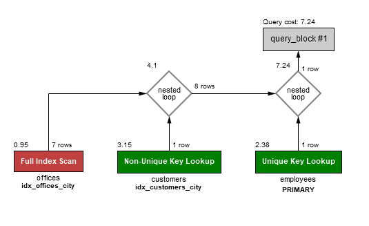

# DatabaseAssignment6

## Before all
Make sure that you have all the databases this assignment needed i.e., classicmodels and coffee.stackexchange.com or askubuntu.com. If you do not have them, please refer to assignment 4 and 5 to get them.

## Excercises
More details about the code are described in 'Assignment_06_Excercises.sql' file.
### Excercise 1
Query
```
select customers.* 
from customers 
left join employees on customers.salesRepEmployeeNumber = employees.employeeNumber
left join offices on employees.officeCode = offices.officeCode
where customers.city = offices.city;
```
Execution plan <br/>
<br/>
We have decided that the performance issue with the cost of the query was that the city column of the customer table was not indexed.

### Excercise 2
We improved on our query's performance by indexing the city column of the customer table as well as the city column in the offices table, just so that there isn't an issue if the database decides to swap around the query order.<br/>
<br/>
We can clearly see that query cost are reduced by almost 80% (39,79 -->>> 7,24), so this one should be better.

### Excercise 3
#### ***A. Using grouping***
Query
```
select sum(payments.amount) as 'sold for', max(payments.amount) as 'max payment', offices.city
from offices
left join employees on offices.officeCode = employees.officeCode
left join customers on employees.employeeNumber = customers.salesRepEmployeeNumber
left join payments on customers.customerNumber = payments.customerNumber
group by offices.officeCode;
```
Execution plan <br/>
<br/>

#### ***B. Using windowing***
Query
```
select DISTINCT offices.city,
sum(payments.amount) OVER (PARTITION BY offices.officeCode) as 'sold for',
max(payments.amount) OVER (PARTITION BY offices.officeCode) as 'max payment'
from offices
left join employees on offices.officeCode = employees.officeCode
left join customers on employees.employeeNumber = customers.salesRepEmployeeNumber
left join payments on customers.customerNumber = payments.customerNumber;
```
Execution plan <br/>
<br/>

#### Difference
Compare both execution plan, we can assume that query cost of windowing at increase a lot, almost 400%. The reason for why the query cost are big can be that SUM() function in OVER clause not only return the total sales for each office, but also the result in each rows, which means total number of rows will be showing in output. <br/> In solution B, we add the SELECT DISTINCT, so we don't get any duplicate rows. If you remove it, you can see the 'real' output.

### Excercise 4
#### ***1. Using display name and join***
Query
```
select users.DisplayName, posts.Title 
from posts 
left join users on posts.OwnerUserId = users.Id 
where posts.Title like '%grounds%';
```
Execution plan <br/>
<br/>

#### ***2. Using userid and without join***
Query
```
select Id, Title 
from posts
where posts.Title like '%grounds%';
```
Execution plan <br/>
<br/>

#### Difference
By comparing both execution plan, we can clearly see that query cost of no join is lower than using join and the reason seems to be that with join, the query will perform sort of scaning on users table then it increases the query cost. We can also see the difference by checking numbers in execution plan i.e., 370,4 + 120,66 = 491,06.

### Excercise 5
Query
```
ALTER TABLE posts 
ADD FULLTEXT(Title);

select users.DisplayName, posts.Title 
from posts 
left join users on posts.OwnerUserId = users.Id 
where match(posts.Title) against('%grounds%');
```
Execution plan <br/>
<br/>
We have decided that "boolean" full-text search ain't necessary for this assignment, but for more advanced searches it would be very useful.
